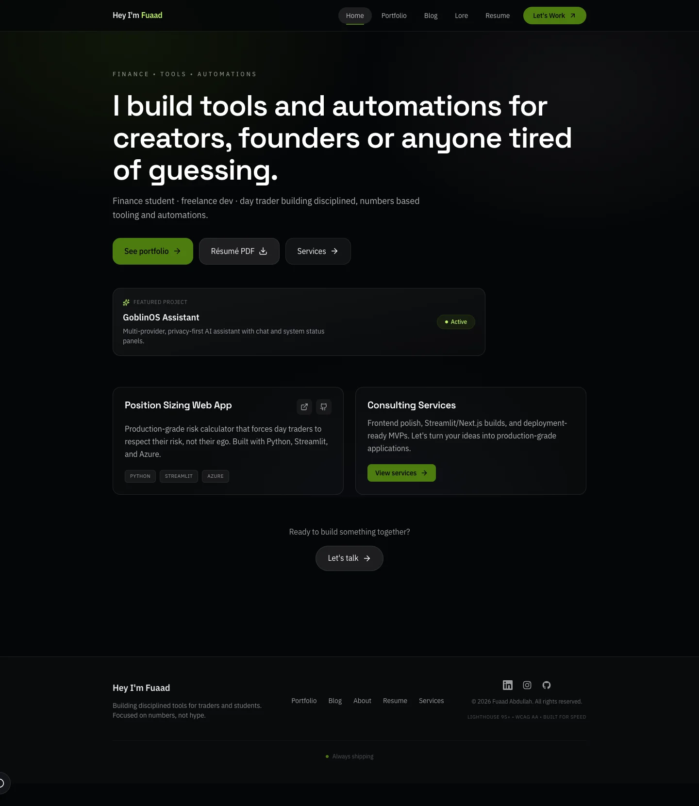
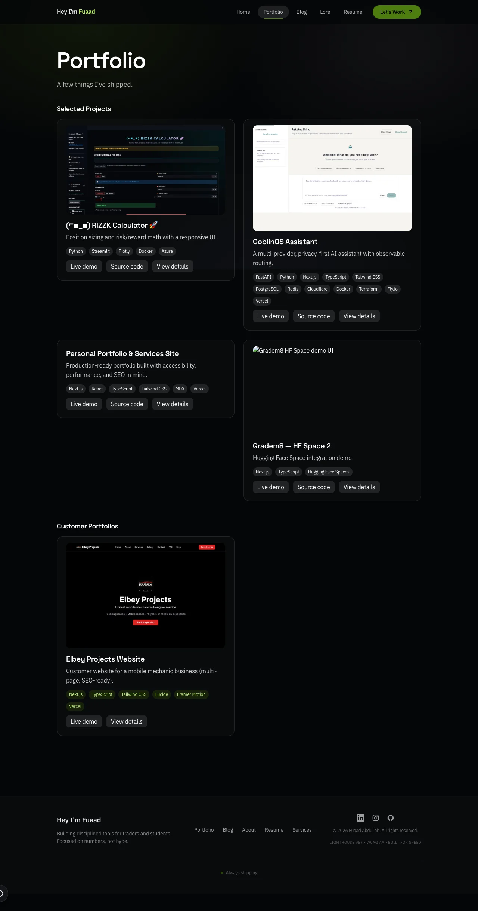
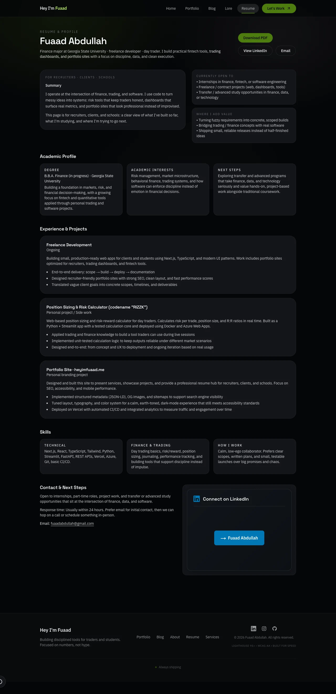

# Fuaad Portfolio

Production portfolio for Fuaad Abdullah, focused on employer-ready project presentation, case studies, and resume delivery.

## What this project does

- Presents selected engineering and fintech-adjacent projects with clear business and technical context.
- Publishes a resume page and downloadable PDF for applications and recruiter outreach.
- Includes lightweight portfolio assistant endpoints and public API docs.

## Screenshots





## Stack

- Next.js (App Router)
- React + TypeScript
- Tailwind CSS
- MDX content pipeline
- Vercel deployment

## Quickstart

```bash
pnpm install
pnpm dev
```

## Quality checks

```bash
pnpm typecheck
pnpm lint
pnpm test:run
```

## Key routes

- `/` home
- `/portfolio` project index
- `/resume` resume page
- `/api-docs` API documentation

## Docs

- [Architecture](docs/architecture.md)
- [Setup](docs/setup.md)
- [Impact](docs/impact.md)

## Contact

- Email: fuaadabdullah@gmail.com
- LinkedIn: https://www.linkedin.com/in/fuaadabdullah
